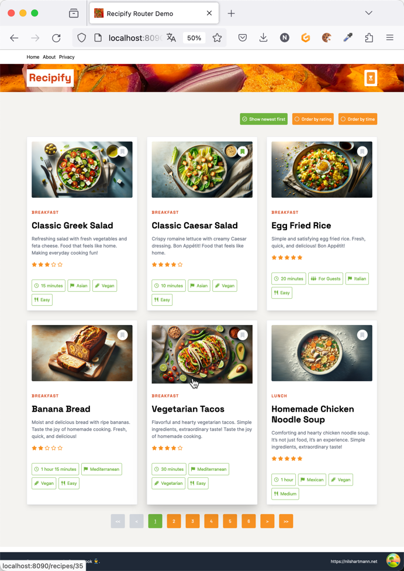

# Deep Dive in das Full-Stack-Framework Next.js

Dieses Repository (https://github.com/nilshartmann/nextjs-java-magazin) enthält den Source-Code für die Beispiel-Anwendung meiner zweiteiligen Artikelserie für das Java-Magazin mit dem Titel "Deep Dive in das Full-Stack-Framework Next.js".

- [Teil 1: ](https://entwickler.de/reader/reading/ijs-magazin/1.2025/9891752098c6fa71cba317ab) auf entwickler.de
- Teil 2 ist noch nicht veröffentlicht

Im folgenden findest Du beschrieben, wie du den Workspace einrichtest und die Anwendung für die Übung startest.



## Voraussetzungen

Auf deinem Computer benötigst Du folgende Software:

- Node.js (mind. Version 18)
- Einen Node Package Manager, am besten pnpm
- Docker bzw. docker-compose

### Aufbau der Anwendung

Die Anwendung besteht aus zwei Teilen, die beide das Backend darstellen:

1. Wir haben ein Backend, das unsere Daten und unsere Geschäftslogik enthält. Die Daten werden mit einer einfachen HTTP API zur Verfügung gestellt (du kannst es dir wie einen externen Dienst vorstellen, den wir in unserer Anwendung integrieren wollen). Dieses Backend bezeichne ich im folgenden einfach nur als **das Backend**. Das Backend ist eine mit in Java mit Spring Boot geschriebene Anwendungen. Du kannst die fertig gebaute Anwendung inklusive Datenbank per `docker-compose` starten (s.u.)
2. Das zweite Backend ist die Next.js-Anwendung. Diese fungiert hier als eine Art "Backend for frontend". Die Anwendung kommuniziert mit dem Backend und stellt das Frontend für den Browser zur Verfügung. Diese Anwendung bezeichne ich im folgenden als **Next.js**-Anwendung.

### Voraussetzungen für das Backend

Es gibt zwei Möglichkeiten, wie Du das Backend starten und verwenden kannst. Im folgenden sind die einzelnen Varianten beschrieben. Weiter unten findest Du jeweils beschrieben, wie du sie verwenden kannst.

### Voraussetzungen für die Next.js-Anwendung

Die Next.js-Anwendung benötigt Node.js (mindestens Version 18). Die Pakete werden mit [pnpm](https://pnpm.io/installation) installiert. Dabei handelt es sich um einen alternativen Package-Manager zur npm, den Du über Node.js selbst aktivieren kannst. Wenn das bei dir nicht funktioniert, sollte auch npm oder yarn funktionieren. Ich habe die Installation aber nur mit pnpm getestet.

Die Next.js-Anwendung läuft auf Port `8110`. Dieser Port muss also bei dir frei sein.

## Installation und Starten des Backends

### Variante 1: Starten des Backends per docker-compose

Du kannst das fertige Backend samt Datenbank starten, in dem Du das `docker-compose-backend.yaml`-File im Root-Verzeichnis des Workspaces startest:

```
docker-compose -f docker-compose-backend.yaml up -d
```

In dem Compose-File sind der Backend-Prozess und die Datenbank beschrieben, so dass Du nichts weiter starten musst.

Wenn das Backend gestartet ist, kannst Du einmal `http://localhost:8080/api/recipes` im Browser öffnen. Dort sollte eine JSON-Liste mit Rezepten zurückgeliefert werden.

### Variante 2: Starten des Java-Prozesses in deiner IDE

Das Java-Projekt wird mit Maven gebaut. Wenn Du das Projekt in deiner IDE öffnest, sollte diese also in der Lage sein, Maven-Projekte zu importieren. Das geht bei IntelliJ z.B. automatisch. Nach dem Importieren und compilieren startest Du die Spring Boot `main`-Klasse `nh.recipify.BackendApplication`.

Diese Klasse sorgt auch automatisch dafür, dass ein Docker-Container mit einer Postgres Datenbank gestartet wird. Voraussetzung dafür ist, dass Du docker-compose auf einem Computer installiert hast.

- Wenn Du IntelliJ verwendest, kannst Du die Run Configuration `01 - Run BackendApplication (with DB)` zum Starten verwenden.

> [!IMPORTANT]  
> Falls Spring Boot das docker-compose-File nicht findet, mit dem die Datenbank gestartet wird, und du eine entsprechende Fehlermeldung im Log siehst, musst Du die Datei `backend/src/main/resources/application.properties` anpassen. Darin gibt es eine Property `spring.docker.compose.file`, die auf die Datei `docker-compose-backend.yaml` im Root-Verzeichnis des Repositories zeigen muss. Du kannst hier einfach den vollqualifizierten Pfad eintragen, in dem bei dir die `docker-compose-backend.yaml`-liegt.

Wenn das Backend gestartet ist, kannst Du einmal `localhost:8080/api/recipes` im Browser öffnen. Dort sollte eine JSON-Liste mit Rezepten zurückgeliefert werden.

## Starten der Next.js-Anwendung

### (Optional) Schritt 1: Installation von pnpm

Grundsätzlich sollte die Installation der npm-Packages mit npm und yarn funktionieren.

Ich habe aber mit [pnpm](https://pnpm.io/) getestet. Falls du noch kein pnpm installiert hast, solltest du das jetzt tun. Dazu gibt es [mehrere Wege](https://pnpm.io/installation). Am einfachsten geht es über [Node.js corepacks](https://nodejs.org/docs/latest-v20.x/api/corepack.html).

Dazu führst Du einfach auf der Kommandozeile folgenden Befehl aus (`corepacks` ist Bestandteil von Node.js):

```
corepacks enable pnpm
```

### Schritt 2: Installation der npm-Packages

Die Anwendung liegt im Verzeichnis `frontend`. In diesem Verzeichnis auf der Kommandozeile bitte folgenden Befehl ausführen:

```
pnpm install
```

(Alternative npm oder yarn verwenden)

### Schritt 3: Starten der Next.js-Anwendung

Die Next.js-Anwendung kannst Du ebenfalls im `frontend`-Verzeichnis starten, in dem Du dort das `dev`-Script ausführst:

```
pnpm dev
```

Die Anwendung startet nun und sollte nach kurzer Zeit auf http://localhost:8110 laufen.

### (optional) Schritt 4: Anpassen der Konfiguration

Zum Ausprobieren der Suspense-Features bzw. des Verhaltens bei langsamen Requests, kannst du die einzelnen Netzwerk-Requests künstlich verlangsamen. Dazu findest du in der Datei `demo-config.tsx` zahlreiche Konstanten, in denen du künstliche Verzögerunen einstellen kannst.

## Fragen, Kommentare, Feedback

Wenn Du Fragen oder Probleme hast, sprich mich gerne an. Hier findest du meine [Kontaktdaten](https://nilshartmann.net/kontakt).

Ich biete **Workshops zu React, Next.js und anderen Themen** an. Bei Bedarf findest du weitere Informationen auf meiner [Homepage](https://nilshartmann.net/workshops).
